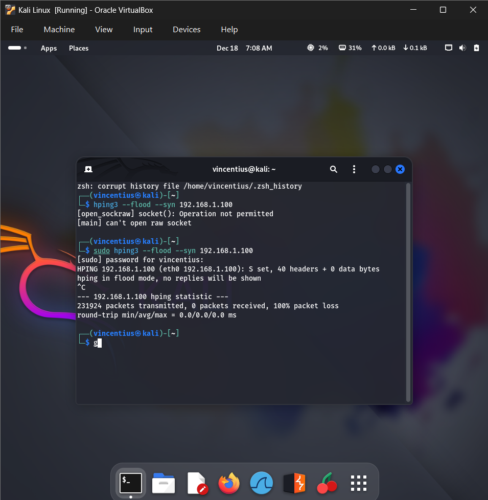
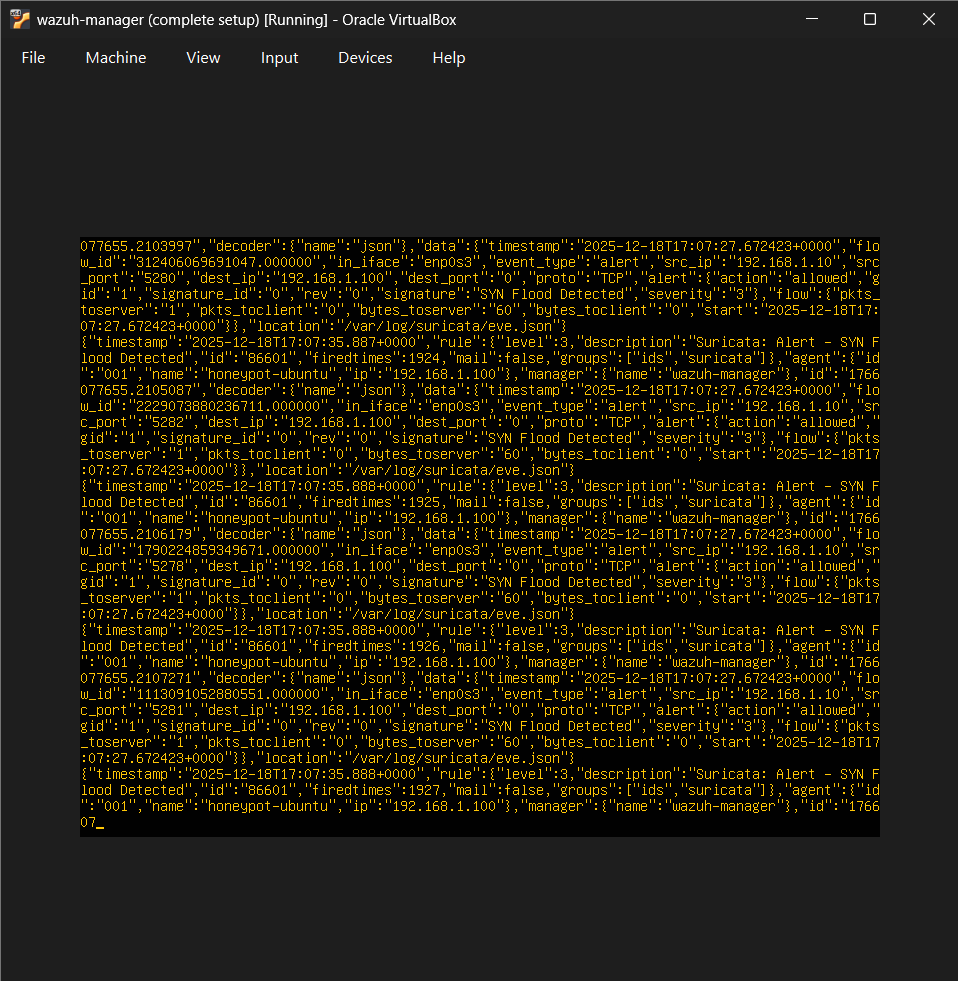
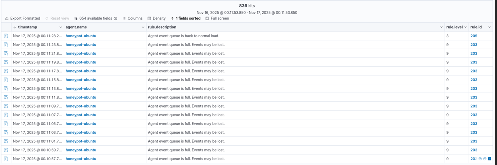

# DDoS-attack-recording-using-wazuh

## 1. PING EACH MACHINE TO OTHER MACHINE

### A.Kali Linux (Attacker)

### B.Honeypot Ubuntu

### C.Wazuh Manager

## 2. DDoS ATTACK TEST
Using hping3 --flood --syn 192.168.1.100

## 3. WAZUH DASHBOARD logs

## 4. WAZUH DASHBOARD DISPLAY

## 5. WIRESHARK DISPLAY

